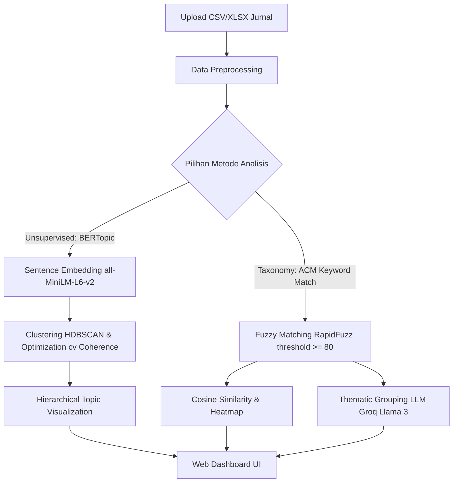

# Research Intelligence (RI) - Structuring Research Centers using Hierarchical Topic Models

An end-to-end data-driven web application developed during a Data Science Internship at the **Research Center for Data and Information Sciences, National Research and Innovation Agency (Pusat Riset Sains Data dan Informasi - PRSDI BRIN)**. 

This project aims to automate the process of mapping research documents (journals, papers) into the **ACM Computing Classification System (ACM CCS 2012)** taxonomy, identifying latent research topics using **BERTopic**, and dynamically grouping research fields into fundamental research groups using Large Language Models (LLMs).

---

## 🚀 Key Features

1. **Academic Data Preprocessing**
   - Cleans academic titles and abstracts by removing copyright notices, editorial metadata, structural labels (e.g., *Design/methodology/approach*), and non-ASCII characters.

2. **ACM CCS Taxonomy Alignment**
   - Automatically maps papers to the ACM CCS taxonomy using fuzzy string matching (`RapidFuzz`) based on a custom threshold of 80.
   - Computes academic field similarities using **TF-IDF Vectorization** and **Cosine Similarity** to output inter-field relation heatmaps.

3. **Advanced Topic Modeling (BERTopic)**
   - Utilizes state-of-the-art unsupervised topic modeling using **BERTopic**:
     - **Embeddings**: SentenceTransformers (`all-MiniLM-L6-v2`)
     - **Dimensionality Reduction**: UMAP
     - **Clustering**: HDBSCAN
     - **Topic Representation**: c-TF-IDF & KeyBERT-Inspired representation.
   - Automatically optimizes `min_cluster_size` parameters by evaluating Topic Coherence ($c_v$) scores programmatically using Gensim.

4. **AI-Powered Research Group Clustering**
   - Integrates the **Groq API (Llama 3 70B)** to group matching ACM CCS research fields into a specified number of fundamental research groups based on thematic similarity.
   - Generates structured, descriptive research group names, descriptions, and allocations in JSON format.

5. **Interactive Web Dashboard**
   - **Analytics Page**: Displays overall dataset statistics (documents, research groups, distinct fields).
   - **Upload Page**: Supports CSV and XLSX files with upload status tracking.
   - **Interactive Visualizations**: Renders dynamic, responsive Plotly charts representing the Top 10 fields and interactive hierarchical topic structures.

---

## 🛠️ Architecture Workflow



---

## 📦 Tech Stack

- **Backend**: Python 3.x, Flask, Pandas, Scikit-learn, Scipy, SentenceTransformers, BERTopic, Gensim, RapidFuzz, Requests (Groq API).
- **Frontend**: HTML5, Vanilla CSS (Custom Maroon theme inspired by BRIN), JavaScript, Plotly.js.

---

## 💻 Installation & Setup

1. **Clone the repository**
   ```bash
   git clone https://github.com/your-username/RI.app.git
   cd RI.app
   ```

2. **Install dependencies**
   ```bash
   pip install -r requirements.txt
   ```

3. **Set up API Key**
   Configure your Groq API Key inside `backend/models/model_match.py` or set it as an environment variable:
   ```python
   api_key = "YOUR_GROQ_API_KEY"
   ```

4. **Run the Application**
   ```bash
   python app.py
   ```
   Open `http://127.0.0.1:5000` in your web browser.

---

## 📂 Project Structure

```text
├── app.py                # Main Flask entrypoint
├── requirements.txt      # List of project dependencies
├── backend/
│   └── models/
│       ├── preprocessing.py  # Data cleaning and filtering
│       ├── model_bert.py     # BERTopic fitting and parameter optimization
│       └── model_match.py    # ACM fuzzy matching and Groq integration
├── dataset/              # Cleaned ACM CCS keyword reference data
├── save_models/          # Cached pre-trained UMAP and CountVectorizer models
├── frontend/
│   ├── static/           # Stylesheets, custom images, and fonts
│   └── templates/        # HTML pages (index.html)
└── uploads/              # Directory for storing uploaded CSV/XLSX datasets
```

---

## 🎓 Internship Background
- **Student Name**: Lutfia Aisyah Putri
- **University**: Institut Teknologi Sumatera (ITERA)
- **Internship Period**: July 1, 2025 – August 15, 2025
- **Research Center**: Pusat Riset Sains Data dan Informasi (PRSDI), Badan Riset dan Inovasi Nasional (BRIN)
- **Advisor**: Rumadi, S.T., M.T.
