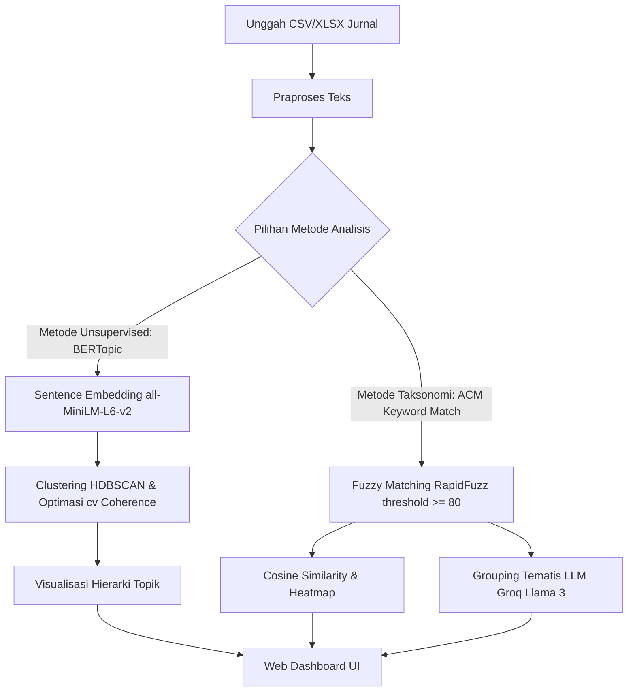

# Research Intelligence (RI) - Penataan Pusat Riset Menggunakan Hierarchical Topic Models

Sebuah aplikasi web *end-to-end* berbasis sains data yang dikembangkan selama kegiatan **Magang Mandiri di Pusat Riset Sains Data dan Informasi, Badan Riset dan Inovasi Nasional (PRSDI - BRIN)** KST Samaun Samadukun Bandung.

Projek ini bertujuan untuk mengotomatisasi pemetaan dokumen publikasi ilmiah (jurnal, paper) ke dalam taksonomi standar internasional **ACM Computing Classification System (ACM CCS 2012)**, mendeteksi topik penelitian laten menggunakan **BERTopic**, dan mengelompokkan bidang ilmu riset secara dinamis ke dalam Kelompok Riset (*Research Groups*) utama menggunakan Large Language Models (LLM).

---

## 🚀 Fitur Utama

1. **Praproses Data Akademik**
   - Membersihkan teks judul dan abstrak publikasi dari gangguan teks seperti informasi hak cipta (copyright), metadata publikasi, label struktural (contoh: *Design/methodology/approach*), dan karakter non-ASCII.

2. **Penyelarasan Taksonomi ACM CCS**
   - Mengklasifikasikan dokumen secara otomatis ke taksonomi ACM CCS 2012 menggunakan pencocokan kata kunci tidak persis (*fuzzy string matching*) melalui pustaka `RapidFuzz` dengan threshold kemiripan 80.
   - Menganalisis tingkat hubungan antar bidang ilmu yang terdeteksi menggunakan kombinasi **TF-IDF Vectorization** dan **Cosine Similarity** untuk menghasilkan visualisasi heatmap interaktif.

3. **Pemodelan Topik Tingkat Lanjut (BERTopic)**
   - Mengimplementasikan algoritma pemodelan topik modern berbasis **BERTopic**:
     - **Embeddings**: SentenceTransformers (`all-MiniLM-L6-v2`)
     - **Dimensionality Reduction**: UMAP
     - **Clustering**: HDBSCAN
     - **Topic Representation**: c-TF-IDF & representasi berbasis KeyBERT.
   - Mengoptimalkan parameter `min_cluster_size` secara otomatis berdasarkan metrik **Topic Coherence ($c_v$)** menggunakan pustaka Gensim.

4. **Pengelompokan Kelompok Riset Berbasis AI**
   - Mengintegrasikan **Groq API (Llama 3 70B)** untuk mengelompokkan bidang-bidang ilmu ACM CCS yang terdeteksi secara otomatis ke dalam sejumlah Kelompok Riset (*Fundamental Research Groups*) tematis.
   - Menghasilkan nama kelompok riset, deskripsi fokus kelompok, dan pembagian bidang ilmu terkait dalam format JSON terstruktur.

5. **Dashboard Web Interaktif**
   - **Halaman Analytics**: Menampilkan statistik umum (total dokumen, total kelompok riset, sebaran bidang ilmu).
   - **Halaman Upload**: Mendukung pengunggahan dokumen riset berformat CSV dan XLSX.
   - **Visualisasi Interaktif**: Menyajikan grafik Plotly.js interaktif untuk Top 10 Bidang Ilmu dan struktur hierarki topik riset.

---

## 🛠️ Alur Arsitektur Sistem



---

## 📦 Spesifikasi Teknologi

- **Backend**: Python 3.x, Flask, Pandas, Scikit-learn, Scipy, SentenceTransformers, BERTopic, Gensim, RapidFuzz, Requests (Groq API).
- **Frontend**: HTML5, Vanilla CSS (Desain kustom bertema Merah Marun BRIN), JavaScript, Plotly.js.

---

## 💻 Instalasi & Cara Menjalankan

1. **Clone repositori**
   ```bash
   git clone https://github.com/Lutfiaaisyah/RI.git
   cd RI
   ```

2. **Install dependensi library**
   ```bash
   pip install -r requirements.txt
   ```

3. **Atur API Key**
   Atur Groq API Key Anda pada file konfigurasi environment variable sistem Anda:
   ```bash
   set GROQ_API_KEY="ISI_API_KEY_GROQ_ANDA"
   ```

4. **Jalankan Aplikasi**
   ```bash
   python app.py
   ```
   Buka alamat `http://127.0.0.1:5000` pada web browser Anda.

---

## 📂 Struktur Projek

```text
├── app.py                # File utama Flask backend
├── requirements.txt      # Daftar dependensi library Python
├── backend/
│   └── models/
│       ├── preprocessing.py  # Modul pembersihan data akademik
│       ├── model_bert.py     # Pipeline BERTopic dan optimasi coherence
│       └── model_match.py    # Modul fuzzy matching ACM & integrasi Groq LLM
├── dataset/              # Data referensi kata kunci taksonomi ACM CCS
├── save_models/          # Cache model konfigurasi UMAP dan CountVectorizer
├── frontend/
│   ├── static/           # Stylesheet CSS, file js, dan aset gambar
│   └── templates/        # Template halaman HTML (index.html)
└── uploads/              # Direktori penyimpanan file CSV/XLSX hasil upload
```

